# Hero Community

## <i> Full Stack Frameworks With Django - Code Institute </i>

---

> **Hero Community** - is a social app for CrossFitters in order to share, compare, coach, track, log and motivate!

---

[](https://shields.io/) [](https://www.python.org/downloads/release/python-360/) [](https://shields.io/)

---

## Demo

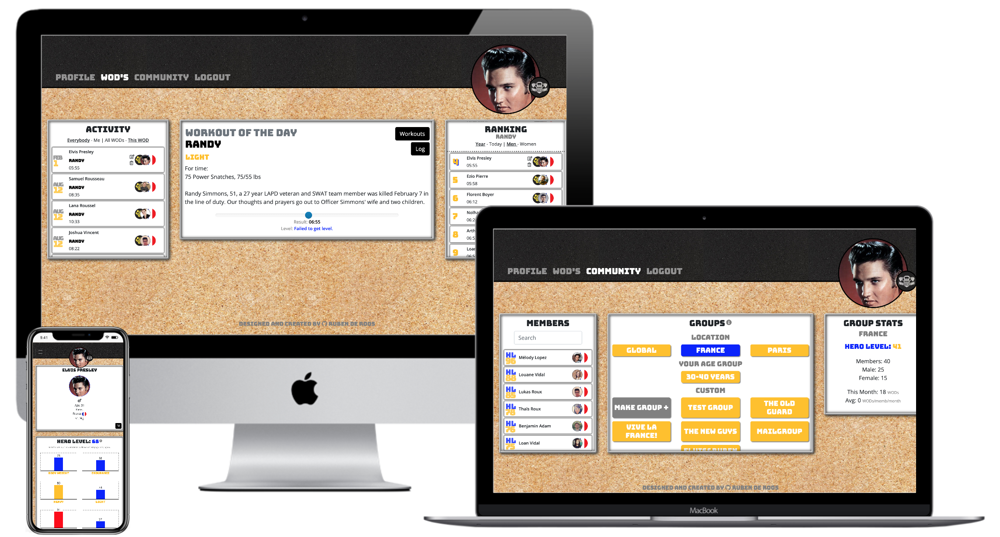

[](https://hero-community.herokuapp.com/)

_To explore the site as an existing user you can log in as "ElvisP" with the password "applepears"._

---

## Table of Contents

> 1.  [**UX**](#ux)
>     - [**User Stories**](#user-stories)
> 2.  [**Scope**](#scope)
> 3.  [**Structure and Features**](#structure)
>     - [**Navigation**](#navigation)
>     - [**Home Page**](#home-page)
>     - [**Profile Page**](#profile-page)
>     - [**WOD's Page**](#wod's-page)
>     - [**Community Page**](#community-page)
>     - [**Login-Signup-Logout-Create Profile Page**](#login-signup-logout-create-profile-page)
>     - [**Further Features**](#further-features)
>     - [**Possible Future Features**](#possible-future-features)
>     - [**Database**](#database)
> 4.  [**Design**](#design)
> 5.  [**Technologies**](#technologies)
> 6.  [**Testing**](#testing)
> 7.  [**Deployment**](#deployment)
> 8.  [**Credits & Acknowledgements**](#credits)
> 8.  [**Creator Notes**](#creator-notes)

---

## UX

My goal was to make a web application similar to the existing website [BeyondTheWhiteboard](https://beyondthewhiteboard.com/).

The basic idea is to create an online platform where a commnity of users can log their workout results and compare to each other and see what level they are at as a function of the total community results. BeyondTheWhiteboard has a lot of feautures on their application, each of which was worth exploring, but due to the limited amount of time available to me I limited the scope of the site functionality to logging, ranking, comparing, commenting and grouping.

Users can make use of the website's functionality for a one time payment of €9,99. I might also have opted for a subscription payment of say €0,99 per month.

During development I spent a lot of time trying to make the UX very user friendly and intuitive: A lot of elements are clickable and linked so you can navigate through the website intuitively through multiple "paths".

### User Stories

#### User

<details>
<summary>As a user, I want to be able to get instructions for a workout.</summary>

    - Navigate to the WOD's page.
    - Main module shows workout instructions OR
    - Click the "Workouts" button.
    - Select a workout from the "workouts" module.
    - Page reloads: instructions are in main module.
</details>
<details>
<summary>As a user, I want to be able to log my results for a workout.</summary>

    - Navigate to the WOD's page (optionally select specific workout).
    - Click on "Log" button in main module.
    - Fill out the log form that appears in the Log module.
    - Click "Log" button in the log module.
</details>
<details>
<summary>As a user, I want to be able to review my previous results.</summary>

    - Navigate to the WOD's page (optionally select specific workout).
    - Click the "Me" option in the Activity module.
    - Choose either "All Wod's" or "This Wod" in the Activity module.
    - Your results filtered as requested by you are visible in the module ordered by date (most recent on top).
    - To load more results simply scroll down.
</details>
<details>
<summary>As a user, I want to be able to edit my results.</summary>

    - Navigate to the WOD's page (optionally select specific workout).
    - Find the log you want to edit either in the Activity module or in the Ranking module.
    - Next to your name in the log card there is an edit icon. Click the edit icon.
    - The Edit form appears in the Log module. Edit the log information.
    - Click the "Edit" button on the bottom of the form.
</details>
<details>
<summary>As a user, I want to be able to view the results of others.</summary>

    - Navigate to the WOD's page (optionally select specific workout).
    - Click the "Everybody" option in the Activity module.
    - Choose either "All Wod's" or "This Wod" in the Activity module.
    - The results filtered as requested by you are visible in the module ordered by date (most recent on top). NOTE: only results of members that are part of your currently selected group in the Community page are shown (default is global, cq: all site users.)
    - To load more results simply scroll down.
    - Other users logs are also visible in the Ranking module.
</details>
<details>
<summary>As a user, I want to be able to see what rank I have.</summary>

    - Navigate to the WOD's page (optionally select specific workout).
    - Choose either "Today" or "Year" in the Ranking module.
    - The module automatically loads the "page" with your result on it (if Rx) and srolls to your position.
    - Your rank is displayed in the left parst of the log card.
</details>
<details>
<summary>As a user, I want to be able to see what rank others have.</summary>

    - Navigate to the WOD's page (optionally select specific workout).
    - Choose either "Today" or "Year" in the Ranking module.
    - The module automatically loads the "page" with your result on it (if Rx) and srolls to your position.
    - All logs listed their by the members of the currently selected group have the rank listed on the left side of the card.
    -To load more logs simply scroll down or press the button at the top of the list to load higher ranks.
</details>
<details>
<summary>As a user, I want to be able to see what level I have.</summary>

    - Navigate to the Profile page.
    - Your levels are displayed in the main module.
    - Click on a level bar to see detailed information about the workout logs contibuting to that level and the level of that individual performance.
</details>
<details>
<summary>As a user, I want to be able to see what level other users have.</summary>

    - Navigate to the Community page.
    - Find the user you want to inspect in the Members module.
    - You can search for a specific member using the search field.
    - You can scroll through the list.
    - You can change the list by selecting a different group.
    - Click on the name of the member you wish to inspect.
    - The members level information appears in the main module.
    - Click on a level bar to see detailed information about the workout logs contibuting to that level and the level of that individual performance.
    - The General level of each user is displayed in the information card in the Members module on the left side.
</details>
<details>
<summary>As a user, I want to be able to create, edit, delete groups of fellow users to which I wish to compare my results.</summary>

    - Navigate to the Community page.
    CREATE
    - Click the "make group" button in the main module. The Group form appears.
    - Enter a name in the group name field.
    - Add users from the members module using the "add user" icons that have appeared in each member card on opening the form.
    - You can close the module an navigate to a different group to get a different list of members to add from.
    - You can search for members using the search field to add them.
    - You can come back to your group form by clicking again on the make group button.
    - You can substract members from the group by looking them up in the members module and clicking the remove user icon which has appeared.
    - Click the submit button to create the group.
    EDIT
    - You can only edit groups that you are the admin of.
    - Click on the group button. An edit icon will appear underneath the button.
    - Click the edit icon.
    - Follow the same steps as above to adjust the group.
    - Click the Edit button to update the group.
    DELETE 
    - Click the (custom) group you want to delete.
    - A delete icon will appear beneath the button.
    - Click the delete icon.
    - The group will now dissappear from your group lists. However, if it is shared, the group will remain active for the other members (a new admin is assigned if were the admin).
</details>
<details>
<summary>As a user, I want to be able to keep a custom created group private.</summary>

    - Navigate to the Community Page.
    - Follow the steps to create or edit a group.
    - In the form, uncheck the "Share" checkbox on the form to keep the group private.
    - The other members of the group will not see this group in thier group lists.
</details>
<details>
<summary>As a user, I want to be able to switch between which group I select.</summary>

    - Navigate to the Community page.
    - In the main module, click on the group that you wish to select.
    - The group button will turn blue, indicating it is selected.
</details>
<details>
<summary>As a user, I want to be able to comment on workout results.</summary>

    - Navigate to the WOD's page.
    - Find the member log you want to comment on, either in the Activity module or in the Ranking module.
    - Click on the center of the log card. This expands the card.
    - At the bottom of the card is a textarea.
    - Fill in the textarea and press return or click on the comment button to submit the comment.
    - Holding shift while pressing return will allow you to insert new lines in your comment.
</details>
<details>
<summary>As a user, I want to be notified about comments on my logs.</summary>

    - When a member comments on one of your logs a notification message will appear withing 10 seconds of the fact if you are currently on the website.
    - If you are not on the site when the member comments, the notification will be renedered the next time you login on the site.
    - The notification mentions the commenting members name, the workout log they commented on and it's date. This allows you to look up the comment by navigating manually to it, using the information provided. (Room for improvement on this feature by enabling automatic navigation)
    - You also receive an email about the notification. (This feature can be switched off by the user.)
</details>
<details>
<summary>As a user, I want to be notified if I've een added to a group.</summary>

    - When a member adds you to a group a notification message will appear withing 10 seconds of the fact if you are currently on the website.
    - If you are not on the site when the member comments, the notification will be renedered the next time you login on the site.
    - The notification mentions the creating members name and the group name.
    - You also receive an email about the notification. (This feature can be switched off by the user.)
</details>
<details>
<summary>As a user, I want to be able to determine which result I need to reach a certain level.</summary>

    - Navigate to the WOD's page.
    - Optionally find and select the workout that you're interested in.
    - In the main module you'll find a slider at the bottom of the module.
    - The slider allows you to slide along different results. When the slider is released the corresponding level is calculated and shown beneath the slider.
</details>
<details>
<summary>As a user, I want to be able to create an account and profile.</summary>

    - Navigate to the sign up page.
    - Fill out the sign up and submit the form.
    - Validate your email address using the email you received after the form submission.
    - Navigate to the login page.
    - Login to your account.
    - The create profile page is loaded.
    - Fill out the form and enter your payment infromation.
    - Submit the form. 
</details>
<details>
<summary>As a user, I want to be able to create an account and profile.</summary>

    - Navigate to the sign up page.
    - Click on the button corresponding with the social site you wish to use.
    - Follow the steps indicated by the site. 
</details>
<details>
<summary>As a user, I want to be able to edit my profile information.</summary>

    - Navigate to the Profile page.
    - Click on the edit button at the bottom of the profile information module. The edit form appears.
    - Edit the information.
    - Click the Edit button. 
</details>

#### Admin

<details>
<summary>As administrator, I expect to be able to add, edit, delete workouts on the website.</summary>

    - Navigate to the WOD's page.
    ADD
    - Click the Create button.
    - Fill out the form that appears.
    - Click the Create button.
    EDIT 
    - Find and select the workout you want to edit.
    - Click the edit button in the main module.
    - Edit the information on the form that appears.
    - Click the edit button.
    DELETE 
    - Find and select the workout you want to delete.
    - Click the delete button in the main module.
</details>
<details>
<summary>As administrator, I expect to be able to edit, delete logs on the website.</summary>

    - Navigate to the WOD's page.
    EDIT 
    - Find the log that you want to edit.
    - Click on the edit icon in the log.
    - Edit the information on the form.
    - Click the edit button.
    DELETE 
    - Find the log that you want tot delete.
    - Click the delete icon in the log.
</details>
<details>
<summary>As administrator, I expect to be able to edit, delete comments on the website.</summary>

    - Navigate to the WOD's page.
    EDIT 
    - Find the log comment that you want to edit.
    - Click on the edit icon next to the comment.
    - Edit the comment.
    - Click the edit button.
    DELETE 
    - Find the log comment that you want tot delete.
    - Click the delete icon next to the comment.
</details>

---

<div align="right">

[Back to Top :arrow_up:](#table-of-contents)

</div>

## Scope

- **Hero Community** is a social application for CrossFitters, which intends to motify the user to workout by a sort of "gamification" of CrossFit: You can challenge yourself to increase your levels and compete with anyone on the website. Only users that have created and payed for an account will have access to the websites functionality.
  We will be using [Django](https://www.djangoproject.com/) web frameworks and the site will be hosted on [Heroku](https://www.heroku.com/postgres) using [Heroku Postgres](https://www.heroku.com/postgres) for the database and [Amazone AWS](https://aws.amazon.com/) to host the static files.

- **User**
  To become a user registration is required. Once users are logged in they will be able to access their profile page which shows the profile information, their workout stats and their level statics.
  From there they can navigate to the WOD's page to view the current workout of the day, recent member activity and member ranking for the workout in question.
  They can also navigate to the Community page where they can select their group for the website, create, edit or delete a group, view other members level statistics and group stats.

- **Administration**
  For creating, editing, deleting workouts the admin can go to the workout page where in the main module the CRUD buttons will appear only if the admin is logged in as a superuser. For editing and deleting logs and comments, CRUD icons will appear next to every log/comment, where for a regular user they would only appear next to logs/comments that they posted.

---

<div align="right">

[Back to Top :arrow_up:](#table-of-contents)

</div>

## Structure and Feautures
### General

The basic structure of the web page is

- _Navigation_ - Top level
- _Body_ - Main page elements
- _Footer_ - Credits link.

The Landing Page, Sign-up Page and Login Page are publically accesible. After a user has signed up and logged in the user is redirected to the create profile page (logout is still accesible). After the user has created a profile (and completed payment),all pages of the site are accessible: Profile page, WOD's page, Community page. These last pages are all structured to contain three "modules".

I had a very basic idea for the website structure before I started writing the code, which I sketched out in some very simple [wireframes](https://github.com/MauRuRo/MSP4-CrossFitCommunityApp/tree/master/documentation) at the start of the process.

#### Sign Up (Registration) and Login

I have used a 3rd Party package called [Allauth](https://django-allauth.readthedocs.io/en/latest/) to take care of the logic.
The users are asked to fill in the Registration with fields ‘Email’, ‘Username’, and password, this is done twice to make sure they are both the same.
You may also use the social account sign up. Facebook and Google.

**Sign Up and Login.**
You may use the social account buttons to sign in or use the form.
The form has two fields, ‘email’ and ‘Password’ and a 'remember me button' and a link for if you have forgotten your password.
All of [Allauth](https://django-allauth.readthedocs.io/en/latest/) HTML pages have been more or less customised to fit the themes of the site.


#### **Navigation**

The navbar is fixed to top of each page. For smaller width screens the navbar will collapse to a bootstrap collapsed navbar (taking the form of a hamburger button). The navbar only has four items: Profile, WOD's, Community and Log Out (or in case you are not logged in it's: Home, Login, Sign Up). There are no sub lists in the nav items. To create optimal UX all site functionality can be easily and intuitively accessed through just these four pages.

The header bar that contains the navbar also includes the user profile image and the site emblem when logged in, or just the website emblem when logged out. When clicking on or hovering over the website emblem a information layover will appear with general information aobut the website.

#### The Footer

The footer stays at the bottom of each page. It contains only a credits link for the website creator (me). As this is just a learning excercise and not a real world application; If this website ever commercially deploys the footer can be used to also contain some legalize links, and other miscalaneous details (contact details, social links).

---

<div align="right">

[Back to Top :arrow_up:](#table-of-contents)

</div>

### **Home Page**

- **Landing page**
The home page or Index page is the landing page for users who do not have, or are not yet signed in to an account.
It displays a enticing text encouring the user buy an account and it displays a caroussel with some images and text which demonstrate the website's capabilities.

<details>
<summary>Landing Page</summary>

<p align="center">
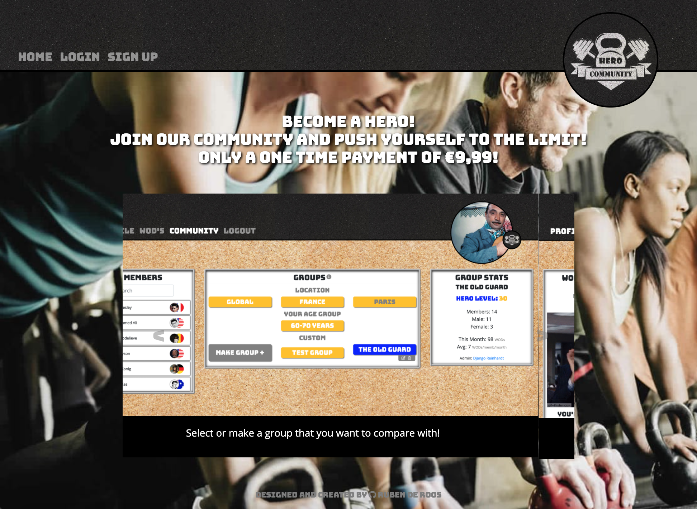
</p>

</details>

---

<div align="right">

[Back to Top :arrow_up:](#table-of-contents)

</div>

### **Profile Page**
<details>
<summary>Profile Page</summary>

<p align="center">
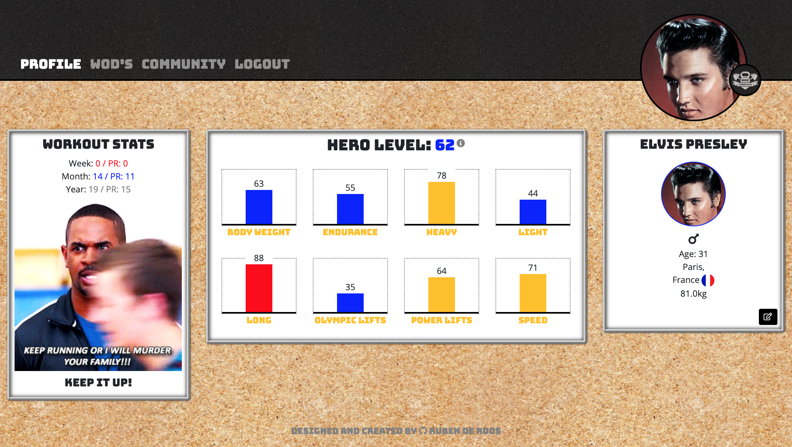
</p>

</details>

- **User Workout Stats**
  This module contains the workout stats for the user; describing the amount of workouts in the past year, the past month and the past week. If the amount of workouts per week or per month is less then the weekly/monthly average (based on the passed year) the text changes from blue to red. Depending on the users "progress" a different motivational gif and accompanying text will be shown.
  <details>
    <summary>Workout Stats</summary>

    <p align="center">
    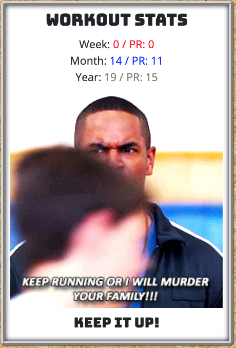
    </p>

    </details>

- **Hero Levels**
  This module displays the user's levels. It annotates a general fitness level ("Hero Level"). It also gives average levels per workout category (of which there are eight). And if a use clicks on the category level bar it can also see the workouts and their corresponding results and levels that build toward the average level in a popover. From that popover users can also navigate to each specific workout on the workout page listed there. The module also conains an information icon which toggles an div with information about that module.
  <details>
  <summary>Hero Levels</summary>

  <p align="center">
  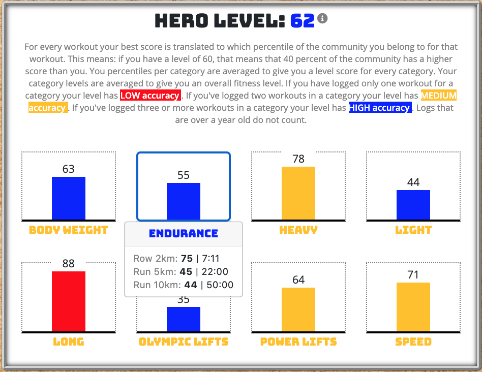
  </p>

</details>

- **Profile Information**
  This module displays the user's profile information. It also contains an edit button which switches the module to an edit module for said profile information.
  <details>
  <summary>Profile Info</summary>

  <p align="center">
  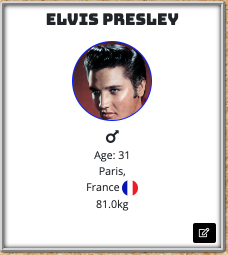
  </p>

</details>

---

<div align="right">

[Back to Top :arrow_up:](#table-of-contents)

</div>

### **WOD's Page**
  <details>
  <summary>WOD's Page</summary>

  <p align="center">
  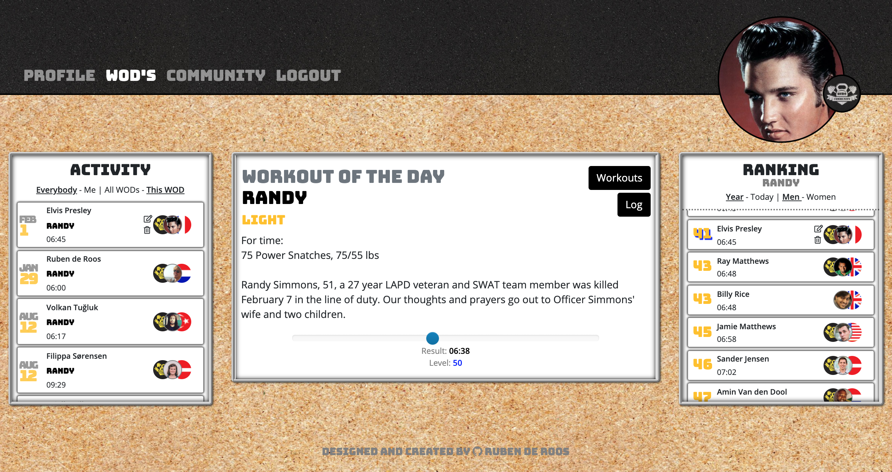
  </p>

</details>

- ***Log Cards***
  This page makes use of "Log cards" in two of it's modules. These are collapsed information holders with only basic information on top (date, workout, result, profile name). It also shows whether a result is a PR for the user and it shows the user profile picture and their country flag (which can be clicked to filter by country, though full country filtering functionallity works better when selecting the country group on the community page). If the user clicks the center div on the card it expands to reveal some extra information, including comments made by members and a little div with a form with textarea where the user can make their own comment. When applicapble (if current user is creator of the object), crud icons appear next to the comment or log information to enable the user to edit/delete.

- **Activity**
  This module shows the logging activity by members (filtered by the group selected in the community module) ordered by date (latest on top). The user can show recent acivity for all members of the group or just themselves. The user can also choose to see acitvity for only the selected workout or for all workouts. The module is a scrolling list. The list consists of 'log cards' (see above). On page load, it loads max 25 cards per category. If the user scrolls down, halfway through the div site makes a call to the database to load the next 25 cards, and so on. If the website is too slow or the user is to fast, there is also a button on the bottom of the list to click to load more cards.
  <details>
  <summary>Activity</summary>
  <p align="center">
  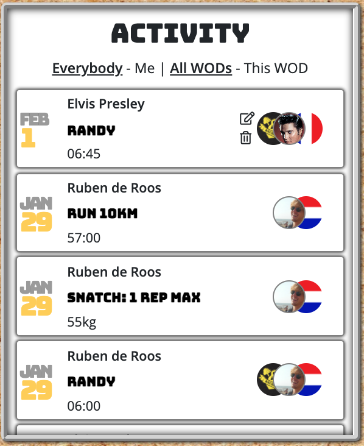
  </p>
  </details>

- **Workout of the Day**
  This module displays the workout of the day, as selected by the site administrator. It contains information about the workout (title, category, description) and also a "story" about the 'hero' (deceased service man/woman) after whom the workout is named. The content for these workout descriptions and information was taken from [BeyondTheWhiteboard](https://beyondthewhiteboard.com/). Furthermore the module also contains a slider, which the user can use to determine the result needed for certain level. 

  The module also includes two buttons (top-right): "Log" (which toggles the Log module in place of the Ranking module) and "Workouts" (which toggles the Workout module in place of the Activity module)

  For the superuser the module also contains CRUD buttons for workouts.
  <details>
  <summary>Workout of the Day</summary>
  <p align="center">
  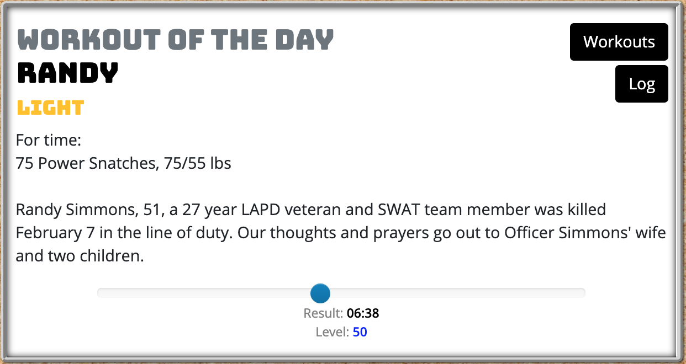
  </p>
  </details>

- **Ranking**
  This module shows the ranked resuls of members (filtered by the group selected in the community module). It is not a simple ordered and numbered list: equal results have equal rank numbers, and the next rank after a sequance of equal results skips a number equal to the amount of equal results. E.g( 1, 2, 3, 3, 5, 5, 7, 8, 9). The user can show ranked logs for men or women and can also show the ranking for just the current day or the entire past year. The module is a scrolling list. The list consists of 'log cards' (see above). On page load, it loads max 25 cards per category. If the user scrolls down, halfway through the div site makes a call to the database to load the next 25 cards, and so on. If the website is too slow or the user is to fast, there is also a button on the bottom of the list to click to load more cards. On page load the module automatically scrolls to the result of the user (and loads the 'page' of 25 logs on which the user's result is on). If their are ranks higher than those loaded on the page a button will appear on top of the list to load the higher ranking results.
  <details>
  <summary>Ranking</summary>
  <p align="center">
  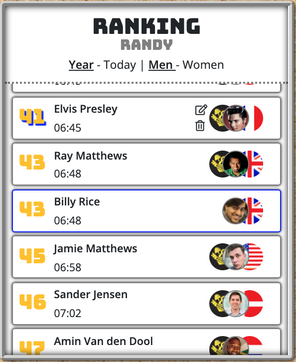
  </p>
  </details>

- **Workouts**
  This module contains a list of workouts per category and a search bar to look for a specific workout. It also indicates which workout is selected as workout of the day. All workouts listed are links to the page for that workout.
  <details>
  <summary>Workouts</summary>
  <p align="center">
  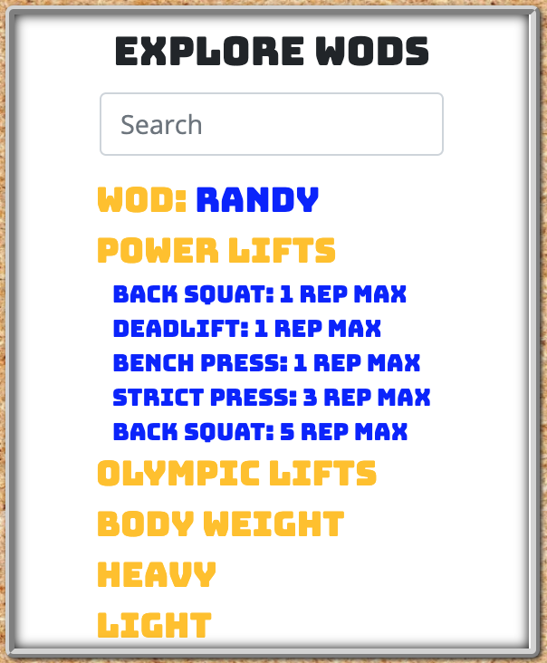
  </p>
  </details>

- **Log**
  This module shows the log submit or log edit form. Depending on the workout type, the field for "For time", "AMRAP" or "Max Weight" result is shown. 
  <details>
  <summary>Log</summary>
  <p align="center">
  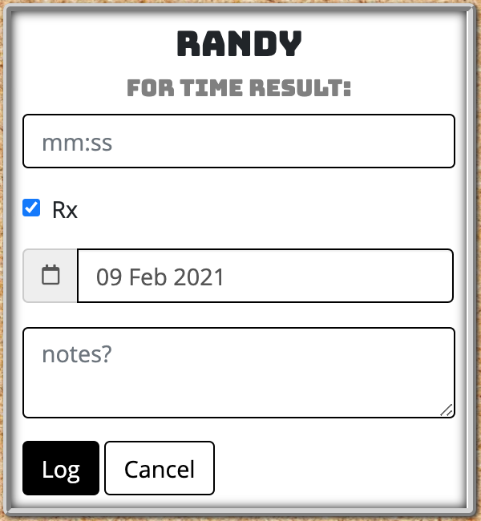
  </p>
  </details>

---

<div align="right">

[Back to Top :arrow_up:](#table-of-contents)

</div>

### **Community Page**
  <details>
  <summary>Community Page</summary>
  <p align="center">
  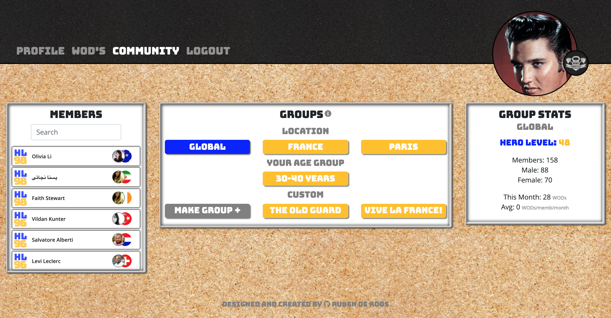
  </p>
  </details>

- **Groups**
  This module shows you the groups that are available to you by default (global, country, city, age) and the (shared) custom groups that you are a member of. You can also create your own group in this module: When clicking "Make Group" button, the module will switch to the create group form letting you enter a group name and select members from the member module. When clicking on custom groups CRUD icons will apear letting you delete and/or edit the group (depending if you are the admin of the group).
  <details>
  <summary>Groups</summary>
  <p align="center">
  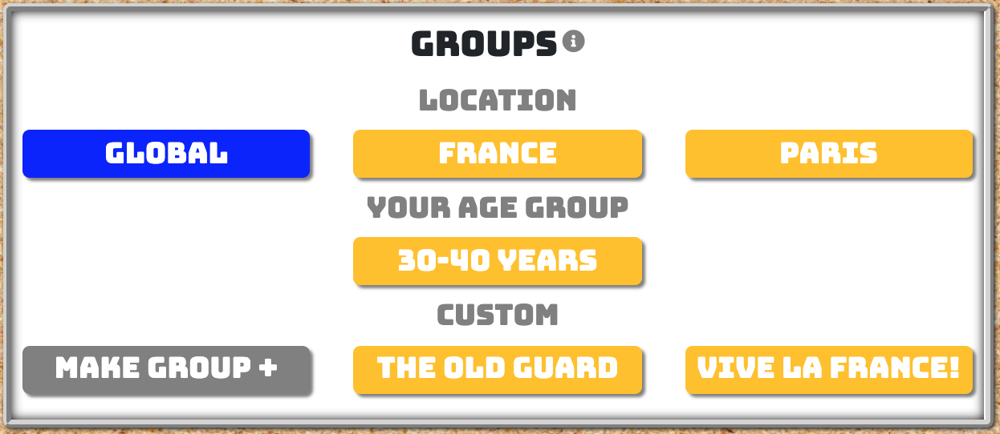
  </p>
  </details>

- **Members**
  This module shows members of the group you have selected in the group module. It loads max 25 member cards and loads the next page of 25 when you scroll down or click the load button (as a backup). It also features search bar which allows you to search within the group for a specific member. If you are creating a group add/delete icons will appear next to the member's name. When you click on a members name the members level and profile information will be shown in the other modules.
  <details>
  <summary>Members</summary>
  <p align="center">
  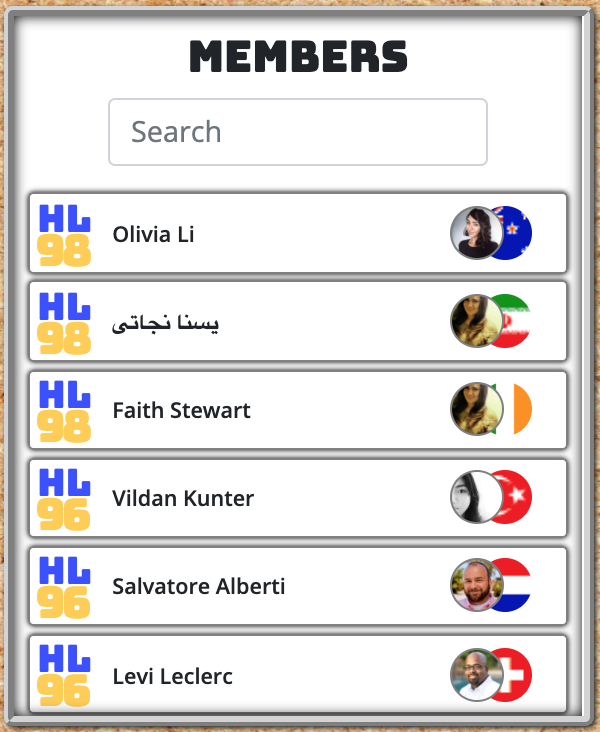
  </p>
  </details>

- **Group Stats**
  This module shows the statistics of the group that's selected: average level, member count, men/women, average activity level and the admin name.
  <details>
  <summary>Group Stats</summary>
  <p align="center">
  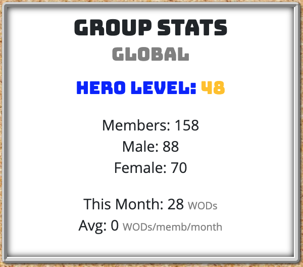
  </p>
  </details>

- **Hero Levels**
  This module shows the hero levels for the selected user and is similar in every way to the module on the profile page.

- **Profile Info**
This module shows the profile information of the selected user, similar to how it is shown on the profile page, but without the CRUD options. 

---

<div align="right">

[Back to Top :arrow_up:](#table-of-contents)

</div>

### **Login-Signup-Logout-Create Profile Page**

- These pages are pretty straight forward and based on the allauth standard templates (with the exception of the create profile page).

- **Stripe Payments** On the Create Profile page is where the user makes their one time payment using [Stripe](https://stripe.com/).

> #### Stripe Development Card
>
> A [Stripe](https://stripe.com/) payment system is inplace and takes all major cards.
> The numbers below are used to test the Stripe Payment software.
>
> - Card number - 4242 4242 4242 4242
> - CVC - Any 3 digit number.
> - Expire date - Any date in the future

---

<div align="right">

[Back to Top :arrow_up:](#table-of-contents)

</div>

### **Further Features**
- **Notifications**
A general feature that's not part of a specific page is the notification feature. When a member comments on another members workout log, the owner of the log get's a notification message on their browser in real time (without having to reload the page). They also receive an email of the notification. The user can opt to turn off the email notifications by changing email settings (form the profile page). The notification feautre also applies to a user adding anther member to a group (of which that member will then receive a notification, if the group is shared).
- **Cronjobs** For the site to work properly in a real world environment, the statistics for inactive users need to be updated regurlarly. I looked in to writing cronjobs using (among others) the django-crontab package, but I could not get this to be implemented following the instructions of the docs. I concluded that use of this package is not possible in a GitPod/Heroku deployment setup. That is why I ended up using Heroku Scheduler as an alternative, which updates the statistics for all users who have not logged in in the past 24 hours once a day.

---

<div align="right">

[Back to Top :arrow_up:](#table-of-contents)

</div>

### **Possible Future Features**
- A graph that tracks a users level progress history.
- A module that let's the user track their BMI over time.
- Challenges and other group features to engage the user more and have them be more active and healthy.
- A seperate module to operate member comments.
- For further inspiration for future features look to [BeyondTheWhiteboard](https://beyondthewhiteboard.com/).

---

<div align="right">

[Back to Top :arrow_up:](#table-of-contents)

</div>

### **Database**

For this Project we used [SQLite](https://www.sqlite.org/index.html) in development because it is integrated as default in [Django](https://www.djangoproject.com/). and [Heroku Postgres](https://www.heroku.com/postgres) in production
[AWS S3](https://aws.amazon.com/s3/) buckets are used to hold all the Static Files. Below you can click to view the ERD schema (generated using [DBeaver](https://dbeaver.io/)).

<details>
<summary>Hero Community ERD Schema</summary>

<p align="center">

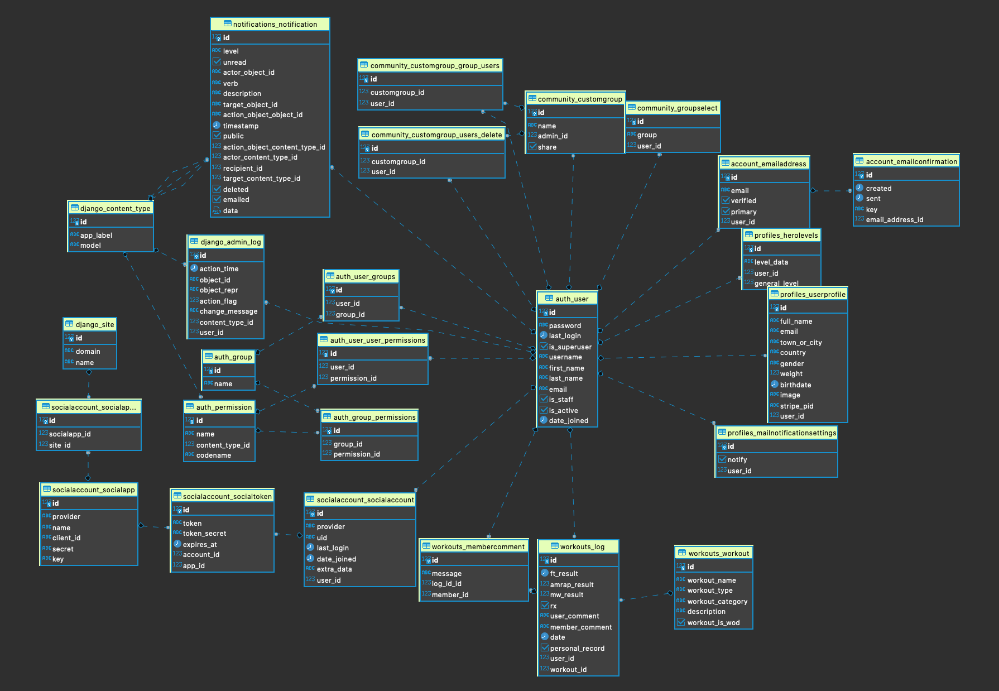

</p>
</details>

---

<div align="right">

[Back to Top :arrow_up:](#table-of-contents)

</div>

## Design

The design of the site is based on elements found in your average CrossFit box: black gym mats (in the header), chipboard for the background (my box has chipboard walls) and whiteboards to hold the modules (this is also a wink to the inspiration of this website: BeyondTheWhiteboard).

#### Images

The site uses few images for it's design.
- [Landing Page background](https://www.facebook.com/Egypt.crossfitters/photos/a.134487927312457/134487907312459)
- [Default profile image](https://boundingintocomics.com/wp-content/uploads/2017/10/Mystery-Hero.png)
- [Black mat for header background](https://www.australianbarbellco.com/FRIBK_dash_FLAT/Black-rubber-gym-floor-tiles.-Square-edge-flat-tile./pd.php)
- [Chipboard main background](https://nl.123rf.com/photo_19478178_pressed-chipboard-background-wood-texture.html)

For the logo I adapted an [existing image](https://www.vectorstock.com/royalty-free-vector/kettlebell-and-dumbbell-with-baner-logo-vector-4156230), and I further adapted it to create the PR emblem.

All artifically generated users have profile pictures that were provided by the [generator API](https://randomuser.me/). Some users where manually made during testing and their profile pictures are mostly personal pictures.

#### Fonts

- [Open sans](https://fonts.google.com/specimen/Open+Sans?query=open+sans&preview.text_type=custom) - Primary Font
- [Bungee](https://fonts.google.com/specimen/Bungee?query=bungee&preview.text_type=custom) - Secondary Font

The primary font [Open sans](https://fonts.google.com/specimen/Open+Sans?query=open+sans&preview.text_type=custom) is used for all paragraph texts and longer texts on the site. It's readable and was recommended as a suplimentary font to Bungee by Googe fonts.
The Secondary font [Bungee](https://fonts.google.com/specimen/Bungee?query=bungee&preview.text_type=custom) is used for headings and short descriptors of main items. It's bulky and strong which emphasizes the CrossFit mentality, but it's not overly flaunty in it's design, still giving the text a clean impression.

#### Colour Scheme

-  `rgb(255, 255, 255)`
-  `rbg(0, 0, 0)`
-  `rgb(128, 128, 128)`
-  `rgb(0, 0, 255)`
-  `rgb(255, 0, 0)`
-  `rgb(255, 193, 7)` 

The colors are mostly primary colors that reminisce of whiteboard markers. I tried to limit the amount of colors to keep the site clean.

<div align="right">

[Back to Top :arrow_up:](#table-of-contents)

</div>

---

## Technologies

### Core Languages, Frameworks, Editors

- [HTML 5](https://en.wikipedia.org/wiki/HTML) ~ Markup language designed to be displayed in a web browser.
- [CSS 3](https://en.wikipedia.org/wiki/Cascading_Style_Sheets) ~ Style sheet language used for describing the presentation of a document in HTML.
- [Python 3.8](https://code.jquery.com/) ~ High-level, general-purpose programming language.
- [Django 3.1.4](https://www.djangoproject.com/) ~ Django is a high-level Python Web framework.
- [jQuery 3.5.1](https://code.jquery.com/) ~ lightweight JavaScript library.
- [Bootstrap 4.5.3](https://getbootstrap.com/) ~ Design and customize responsive mobile-first sites.
- [Heroku](https://heroku.com) ~ A cloud based platform - as a service enabling deployment of CRUD applications.
- [Heroku Postgres](https://www.heroku.com/postgres) ~ PostgreSQL's capabilities - as a fast, functional, and powerful data resource.
- [Heroku Scheduler](https://devcenter.heroku.com/articles/scheduler) ~ A Heroku platform that can perform scheduled tasks (cronjobs) at set intervals.

#### Third-Party Tools

- [GitHub](https://github.com/) ~ Distributed version control and source code management (SCM) functionality of Git, plus its own features.
- [Font Awesome](https://fontawesome.com/) ~ Font Awesome icons
- [Git](https://git-scm.com/) ~ Distributed version control system

- [W3 Validator](https://validator.w3.org/nu/) ~ The HTML Validation Service.
- [W3C CSS Validation](https://jigsaw.w3.org/css-validator/) ~ A CSS validator checks your Cascading Style Sheets to make sure that they comply with the CSS standards set by the W3 Consortium.
- [JShint](https://jshint.com/) ~ An online Javascript validator.
- [Google Fonts](https://fonts.google.com/) ~ A library free licensed font families, an interactive web directory for browsing the library.

<div align="right">

[Back to Top :arrow_up:](#table-of-contents)

</div>

---

## Testing

During the development of the project the code was consistently tested at every incremental addaptation manually; testing for expected behavior with valid and invalid input, tested accross different browsers (Chrome, Safari, FireFox) and on mobile devices (Safari iOS).

Responsiveness was also tested throughout the development process manually.

All forms were thorougly manually tested, testing invalid inputs on each field. 

The functioning of the website was tested with a database of up to 80.000 rows (500 users and their logs). It functioned smoothly demonstrating the capability to function for a large scale user database. For Heroku deployment it was necessary to scale back the amount of users and logs to stay below the 10.000 row limit of the free postgres database.

After deployment the website was beta-tested by a group of friends, which resulted in some significant addaptations, namely the addition security settings in the settings.py file (line 249), to ensure that the website is always run securely from https, as it turned out this did not happen automatically and for one of the testers resulted in the javascript not loading. Also an issue with a overfow-x not being defined resulted in a mysterious floating scrollbar on an invisible div; this was also resolved thanks to the beta testing.

Besides manual testing all the HTML files and the CSS file have been tested using W3 validator. All custom javascript files have been tested by using JShint. Python files have continuously been monitored for issues using PEP8.

There were no major issues: the html validator could not handle the django template and jinja syntax though. The python validator noted some "line too long" issues, but in those cases the choice to not break up the line was a concious one as it would have made the readability less good, in my opinion.

One noteworthy issue that did turn up was that div elements were nested inside an ol element (in the activity and ranking module ). Apparently this is not correct html, however since it does not present any functionality issues and translating to correct html would be a lot of work I decided to leave it as is.

For the testing of the user stories I refer you to [User Stories](#user-stories). (Click to expand each story instructions.)

 <div align="right">

[Back to Top :arrow_up:](#table-of-contents)

</div>

---

## Deployment

### Local Deployment

To be able to clone this project there are a few things you will need.

- [Git](https://git-scm.com/) - Install Git, installation docs and be found [here](https://git-scm.com/book/en/v2/Getting-Started-Installing-Git)
- [Pip](https://pip.pypa.io/en/stable/installing/) - install pip, installation docs can be found [here](https://pip.pypa.io/en/stable/installing/)
- A [Gmail](https://www.gmail.com/mail/help/intl/en/about.html?utm_expid=...) account with app secret key.

Once you have [Git](https://git-scm.com/) and [Pip](https://pip.pypa.io/en/stable/installing/) installed.

1. From the terminal create the directory you want to work in.

   ```bash
   $ mkdir <filename>
   ```

2. Change into Directory

   ```bash
   $ cd <filename>
   ```

3. Clone the repository from github.

   ```bash
   $ git clone https://github.com/MauRuRo/MSP4-CrossFitCommunityApp.git
   ```

4. Change into MSP4-CrossFitCommunityApp directory.

   `$ cd MSP4-CrossFitCommunityApp`

5. Install [virtualenv](https://pypi.org/project/virtualenv/)

   ```bash
   $ pip install virtualenv
   ```

6. Create a virtual environment (env)

   ```bash
   $ virtualenv env
   ```

7. Activate env with:

   ```bash
   $ source env/Scripts/activate
   ```

8. In focus folder make an `.env` file and add the variables below.

   > There is a handy .templates.env file with all the variables.

   | Key                 |      Value      |
   | ------------------- | :-------------: |
   | SECRET_KEY          | < Your Values > |
   | EMAIL_HOST_PASS     | < Your Values > |
   | EMAIL_HOST_USER     | < Your Values > |
   | DEVELOPMENT         |      True       |
   | STRIPE_PUBLIC_KEY   | < Your Values > |
   | STRIPE_SECRET_KEY   | < Your Values > |
   | STRIPE_WH_SECRET    | < Your Values > |

9. Install all the requirements needed to run the project.

   ```bash
   $ pip install -r requirements.txt
   ```

10. Then migrate

    ```bash
    $ python manage.py migrate
    ```

11. Create superuser.

    ```bash
    $ python manage.py createsuperuser
    ```

12. To populate the database with fictional users and logs:

    ```bash
    $ python manage.py loaddata db.json
    ```

13. If you want to use the allauth social accounts, and have you [Facebook](https://developers.facebook.com/products/facebook-login/) secrets setup. add them to the `.env` file.
    | Key | Value |
    |----------|:-------------:|
    | SOCIAL_AUTH_FACEBOOK_KEY | < Your Values >|
    | SOCIAL_AUTH_FACEBOOK_SECRET | < Your Values > |

    If you are not using the social accounts, comment out lines 60/61 in settings.py (INSTALLED_APPS) socialaccounts.

14. Run project with

    ```bash
    $ python manage.py runserver
    ```

 <div align="right">

[Back to Top :arrow_up:](#table-of-contents)

</div>

---

### Heroku Deployment

You will need a [AWS](https://aws.amazon.com/s3/) account and a [S3 bucket](https://aws.amazon.com/s3/) to hold all the static files for this project.
If you would like to use the [allauth](https://django-allauth.readthedocs.io/en/latest/) socialaccounts logins, you can find out more here. [Facebook](https://developers.facebook.com/products/facebook-login/) and [Google](https://developers.google.com/identity/sign-in/web/sign-in)

1.  Open Heroku.
2.  Install the Heroku Command Line Interface (CLI). You use the CLI to manage and scale your applications, provision add-ons, view your application logs, and run your application locally.
    Create an account and navigate to the dash dashboard.
3.  Click on the **New** button.
4.  Click - **Create New App**.
5.  Create a corresponding app name that we use to deploy our application. The apps **name** must be **unique.**.
6.  Pick a server location that is closest to you.
7.  Once the app is created click on the resources button and choose the Heroku Postgres to attach a postgres database to your project.
8.  To be able to run on Heroku A few more libraries are needed. Though they should be installed already since they are in the requirements.txt.
    [Guniorn](https://gunicorn.org/) a (WSGI HTTP Server), [dj-databas-url](https://pypi.org/project/dj-database-url/) to connect with PostgreSQL and [Psycopg](https://www.psycopg.org/)(PostgreSQL adapter)

        ```bash
        $ pip install Gunicorn, dj-database, Psycopg
        ```

9.  To migrate to the postgres db. First `import dj-databas-url` at the top of the setting.py. This is already done.
10. Then comment out the default database configuration and add:

    ```python
    DATABASES = {
        'default': dj_database_url.parse(os.environ.get('< Put your DATABASE_URL here >'))
    }
    ```

    > In Heroku, Click into the settings tab and navigate to **'reveal config vars'**.
    > Here you will find the _'DATABASE_URL'_.

11. Make migrations by following steps 10-15 in [Local deployment](#local-deployment).
12. After migrations are complete, change database configurations to:

    ```python
    if 'DATABASE_URL' in os.environ:
        DATABASES = {
            'default': dj_database_url.parse(os.environ.get('DATABASE_URL'))
        }
    else:
        DATABASES = {
            'default': {
                'ENGINE': 'django.db.backends.sqlite3',
                'NAME': os.path.join(BASE_DIR, 'db.sqlite3'),
            }
        }
    ```

    > This uses Postgres in deployment and sqlite3 in development.

13. Enter in all your AWS variables as well as all your `.env` variables into Heroku's Config Vars.

    | Key                   |      Value      |
    | --------------------- | :-------------: |
    | AWS_SECRET_ACCESS_KEY | < Your Values > |
    | AWS_ACCESS_KEY_ID     | < Your Values > |
    | USE_AWS               |      True       |

    > You will get in them when you setup your [AWS bucket](https://aws.amazon.com/s3/).
    > If you want to use the [allauth](https://django-allauth.readthedocs.io/en/latest/) social accounts, add your [Facebook](https://developers.facebook.com/products/facebook-login/) secrets into the 'Config Vars'. [Googel](https://developers.google.com/identity/sign-in/web/sign-in) setup here.

    | Key                         |      Value      |
    | --------------------------- | :-------------: |
    | SOCIAL_AUTH_FACEBOOK_KEY    | < Your Values > |
    | SOCIAL_AUTH_FACEBOOK_SECRET | < Your Values > |

14. In your Terminal. Navigate to your directory.
    Login to Heroku using the Terminal

        ```bash
        $ heroku login -i
        ```

15. Create a `Procfile` This file tells heroku how to run the project

    ```bash
    $ web: gunicorn crossfit_community.wsgi:application
    ```

16. Freeze your requirements

    ```bash
    $ pip freeze > requirements.txt
    ```

17. Add files and commit to github using

    ```bash
    $ git add .
    ```

18. Commit changes to Github

    ```bash
    $ commit -m "Your message"
    ```

19. Now that heroku is ready to go, Inside the Django setting.py you will need to set up the AWS configs so the static files have a place to go.
    Add

        ```python
        if 'USE_AWS' in os.environ:
            AWS_STORAGE_BUCKET_NAME = < Your Bucket Name >
            AWS_S3_REGION_NAME = < Your server location >
            AWS_ACCESS_KEY_ID = os.environ.get('AWS_ACCESS_KEY_ID')
            AWS_SECRET_ACCESS_KEY = os.environ.get('AWS_SECRET_ACCESS_KEY')
            AWS_S3_CUSTOM_DOMAIN = f'{AWS_STORAGE_BUCKET_NAME}.s3.amazonaws.com'
            AWS_DEFAULT_ACL = None

        # Static and media files

            STATICFILES_STORAGE = 'custom_storages.StaticStorage'
            STATICFILES_LOCATION = 'static'
            DEFAULT_FILE_STORAGE = 'custom_storages.MediaStorage'
            MEDIAFILES_LOCATION = 'media'
            STATIC_URL = f'http://{AWS_S3_CUSTOM_DOMAIN}/{STATICFILES_LOCATION}/'
            MEDIA_URL = f'http://{AWS_S3_CUSTOM_DOMAIN}/{MEDIAFILES_LOCATION}/'
        ```

        >Specifies the hosts that focus can run on

        ```python
            ALLOWED_HOSTS = ['hero-community.herokuapp.com', 'localhost',]
         ```

20. You are ready to push to Heroku

    ```bash
    $ git push heroku master
    ```

21. When your app is deployed successfully. Click '_Open App_' in to top right hand corner of Heroku to open app in browser.

 <div align="right">

[Back to Top :arrow_up: ](#table-of-contents)

</div>

---

## Credits

### Code

- The project’s code was developed by following the [Code Institute](https://codeinstitute.net/) video lessons and based on the understanding of the course material, and the course "Boutique Ado" Django app example. The code has been customized and enhanced to fit with the purpose of the project.
- The [Django Documentation](https://docs.djangoproject.com/en/3.1/) and [Stack Overflow](https://stackoverflow.com/) have been referred to regularly.
- Over the course of the development of this project I purused all over the world wide web to inform myself, learn and find solutions. One site in particular gave me a solution for how I wanted to load my data to the page (which I discoverd I could not do in one go since it was too much data): https://alphacoder.xyz/lazy-loading-with-django-and-jquery/.


### Content

- For the content of the workout information I have taken text from [BeyondTheWhiteboard](https://beyondthewhiteboard.com/). For the images I refer you to the [Design](#design) segment.
All other textual data was fabricated by myself.

- This README file has been structured (and is in parts copied from (where similar information applied)) based on the extremely thorough README file of my fellow CI student [Clint Davis's  project: Focus Fitness](https://github.com/Clinton-Davis/focus_fitness/blob/master/README.md).


 <div align="right">

[ Back to Top :arrow_up:](#table-of-contents)

</div>

---

## Creator Notes

As the final project in the Full Stack Developer Course of Code Institute, I definitely spend a lot more time on this one than any of the other projects. I had to learn a lot by continuously looking up answers to the questions I had on various message boards, including Stack Overflow and Stack. On a few occasions I also requested Tutor assistence. Sometimes I could copy solutions other developers had found, other times I had to rely on my own ingenuity. 

I chose to do a project that was significantly different form the webshop example from the course material. This presented some challenges, most noteworthy one that I only fully understood halfway through developing: As I was partway through completing the website, I noted it was time to populate the database with a significant amount of users and logs in order to properly demonstrate the websites purpose and fucntionality as a statistical analysis tool. I spend some time writing code to generate the fictional users, and sequentially generate logs for each user for each workout (4 logs per workout per user in fact). This code is no longer in the project. In the end I generated 500 fictional users, each with 4 logs for each of 5 workouts for each of 8 categories. As noted by Heroku later on, this resulted in over 80.000 rows in the database (exceeding the maximum of 10k rows in the free tier ussage of heroku).

With the database populated with the new data a immediatley learned that I had to significantly refactor and alter my code to accomodate this. There were issues with loading time (calculating hero-levels) and the loading of all the log entries to the page in one go (which was not possible, so I had to conceive of the scrolling pagination solution). Whilst trying to solve these issues I spent a lot of time learning about Asynchronous Django and Threading, where calculations would be made simultaneously and (in my mind) the complete function would thus complete faster. This turned out to be a false assumption. I also did a short tutorial in React, which was recommended by a fellow student as a possible solution. But this did not turn out to be the solution.

In the end refactoring my python code to make as little as possible calls to the data base was the solution, letting the site function smoothly for a large user base.

Dealing with this challenge definitely taught me a lot that I would not have learned by making a basic webshop project.

Something to note; during the final weeks of the development of this project GitPod was having general issues (in Europe), not always performing normally. This sometimes made it impossible to issue the manage.py runserver command, resulting in an inabitly to test the implemantation/adaptation of (new) code. During this period I made many git commits, since I had already deployed to heroku, in order to be able to keep developing, examining my changes on the deployed website. This might result in a strange git log history.

As this was a learning project; along the way I became more proficient and understanding of the code languages I was using. The logic of the website grew in an organic way as my knowledge progressed. Looking back some of the logic could definitely be re-written in a more efficient way. Due to time constraints, I will not take the time to do this.

###### <i>Disclaimer: This project was created for educational purposes only as part of the Code Institute Full Stack Software Development Course for Milestone 4 Django!</i>

 <div align="right">

[ Back to Top :arrow_up:](#table-of-contents)

</div>

---